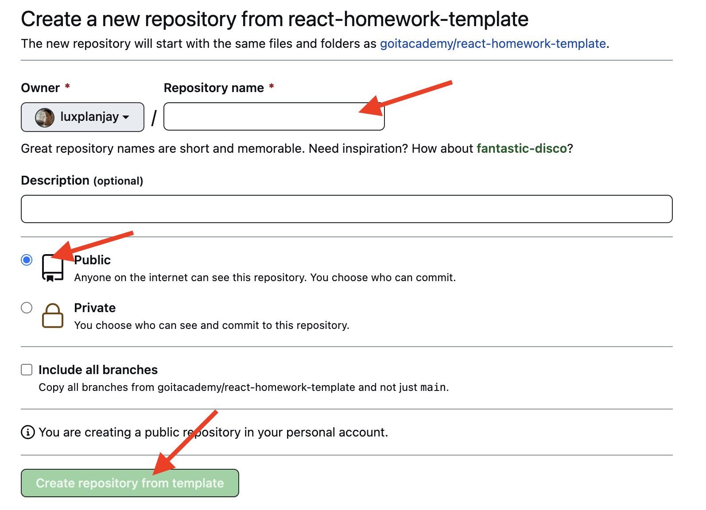

# Car Rental App

---

Welcome to the Car Rental App! This application is built with React and utilizes
a mockapi backend for server simulation. Below, you'll find a brief guide on how
to run, deploy, and use the application.

## Table of Contents

---

- [Routing](#routing)

- [Getting Started](#getting-started)
- [Technologies Used](#technologies-used)
- [API](#api)
- [Redux State](#redux-state)

## Routing

---

The app uses React Router for navigation. The available routes are:

- **Home Page (/)**

  - On the homepage, you'll find a welcome message and basic information about
    the application.

- **Catalog Page (/catalog)**

  - The catalog page displays a list of available rental cars. Here, you can
    browse and view details about the cars.You can open modal window, by
    pressing the "Learn more" button, to view the detailed information.Then you
    can rent a car by simply pressing "Rental car" in this modal window. You are
    also able to choose favourite cars, by pressing the heart(which will
    immediately turn red)

- **Favorite Page (/favorites)**
  - This page shows your favorite cars. You can add and remove cars from your
    favorites list.

## Getting Started

---

To get started with the app, follow these steps:

1. Clone the repository to your local machine.
2. Install dependencies using `npm install`.
3. Run the app with `npm start`.

## Technologies Used

---

- **React**: A JavaScript library for building user interfaces.
- **Redux Toolkit**: An official, opinionated, batteries-included toolset for
  efficient Redux development.
- **React Router Dom**: DOM bindings for React Router, enabling navigation in a
  React application.
- **Axios**: A promise-based HTTP client for making API requests.

## API

---

We use [mockapi.io](https://www.mockapi.io/) to simulate the server. Please
refer to their [documentation](https://mockapi.io/docs) for additional
information.

## Redux State

---

The Redux store manages the application's state.

## React homework template

Этот проект был создан при помощи
[Create React App](https://github.com/facebook/create-react-app). Для знакомства
и настройки дополнительных возможностей
[обратись к документации](https://facebook.github.io/create-react-app/docs/getting-started).

## Создание репозитория по шаблону

Используй этот репозиторий организации GoIT как шаблон для создания репозитория
своего проекта. Для этого нажми на кнопку `«Use this template»` и выбери опцию
`«Create a new repository»`, как показано на изображении.


На следующем шаге откроется страница создания нового репозитория. Заполни поле
его имени, убедись что репозиторий публичный, после чего нажми кнопку
`«Create repository from template»`.



После того как репозиторий будет создан, необходимо перейти в настройки
созданного репозитория на вкладку `Settings` > `Actions` > `General` как
показано на изображении.


Проскролив страницу до самого конца, в секции `«Workflow permissions»` выбери
опцию `«Read and write permissions»` и поставь галочку в чекбоксе. Это
необходимо для автоматизации процесса деплоя проекта.


Теперь у тебя есть личный репозиторий проекта, со структурой файлов и папок
репозитория-шаблона. Далее работай с ним как с любым другим личным репозиторием,
клонируй его себе на компьютер, пиши код, делай коммиты и отправляй их на
GitHub.

## Подготовка к работе

1. Убедись что на компьютере установлена LTS-версия Node.js.
   [Скачай и установи](https://nodejs.org/en/) её если необходимо.
2. Установи базовые зависимости проекта командой `npm install`.
3. Запусти режим разработки, выполнив команду `npm start`.
4. Перейди в браузере по адресу [http://localhost:3000](http://localhost:3000).
   Эта страница будет автоматически перезагружаться после сохранения изменений в
   файлах проекта.

## Деплой

Продакшн версия проекта будет автоматически проходить линтинг, собираться и
деплоиться на GitHub Pages, в ветку `gh-pages`, каждый раз когда обновляется
ветка `main`. Например, после прямого пуша или принятого пул-реквеста. Для этого
необходимо в файле `package.json` отредактировать поле `homepage`, заменив
`your_username` и `your_repo_name` на свои, и отправить изменения на GitHub.

```json
"homepage": "https://your_username.github.io/your_repo_name/"
```

Далее необходимо зайти в настройки GitHub-репозитория (`Settings` > `Pages`) и
выставить раздачу продакшн версии файлов из папки `/root` ветки `gh-pages`, если
это небыло сделано автоматически.


### Статус деплоя

Статус деплоя крайнего коммита отображается иконкой возле его идентификатора.

- **Желтый цвет** - выполняется сборка и деплой проекта.
- **Зеленый цвет** - деплой завершился успешно.
- **Красный цвет** - во время линтинга, сборки или деплоя произошла ошибка.

Более детальную информацию о статусе можно посмотреть кликнув по иконке, и в
выпадающем окне перейти по ссылке `Details`.


### Живая страница

Через какое-то время, обычно пару минут, живую страницу можно будет посмотреть
по адресу указанному в отредактированном свойстве `homepage`. Например, вот
ссылка на живую версию для этого репозитория
[https://goitacademy.github.io/react-homework-template](https://goitacademy.github.io/react-homework-template).

Если открывается пустая страница, убедись что во вкладке `Console` нет ошибок
связанных с неправильными путями к CSS и JS файлам проекта (**404**). Скорее
всего у тебя неправильное значение свойства `homepage` в файле `package.json`.

### Маршрутизация

Если приложение использует библиотеку `react-router-dom` для маршрутизации,
необходимо дополнительно настроить компонент `<BrowserRouter>`, передав в пропе
`basename` точное название твоего репозитория. Слеш в начале строки обязателен.

```jsx
<BrowserRouter basename="/your_repo_name">
  <App />
</BrowserRouter>
```

## Как это работает


1. После каждого пуша в ветку `main` GitHub-репозитория, запускается специальный
   скрипт (GitHub Action) из файла `.github/workflows/deploy.yml`.
2. Все файлы репозитория копируются на сервер, где проект инициализируется и
   проходит линтинг и сборку перед деплоем.
3. Если все шаги прошли успешно, собранная продакшн версия файлов проекта
   отправляется в ветку `gh-pages`. В противном случае, в логе выполнения
   скрипта будет указано в чем проблема.
